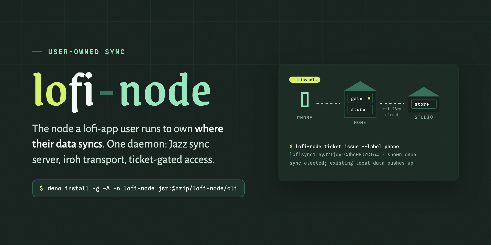

# @nzip/lofi-node

**Self-host the sync backend for [lofi](https://github.com/FelineStateMachine/lofi) apps: one daemon
embedding a Jazz sync server, iroh peer-to-peer transport, and ticket-gated access.**

Issue a ticket carrying location + secret; the app seals it at rest — admin capability behind the
user's passkey — and syncs against your node. Pair homes by ticket — no static IPs, no cloud — and
choose where your data lives.

[Documentation](https://lofi.host/node) · [API reference](https://lofi.host/node/api) ·
[JSR package](https://jsr.io/@nzip/lofi-node) · [MIT License](LICENSE)

Building with an AI agent? Feed it [llms.txt](https://lofi.host/node/llms.txt) for an index of the
node documentation, or [llms-full.txt](https://lofi.host/node/llms-full.txt) for the complete docs
and API reference in one file.

## Quick start

Run straight from JSR with `dx` (Deno's npx — `deno x`):

```sh
dx -A jsr:@nzip/lofi-node/cli init --port 4802     # ticket-gated by default
dx -A jsr:@nzip/lofi-node/cli start                # gate URL + node-pairing ticket
dx -A jsr:@nzip/lofi-node/cli ticket issue --label phone   # app-connect ticket (shown once)
```

Equivalent forms:

```sh
deno run -A jsr:@nzip/lofi-node/cli start                  # plain deno
deno install -g -A -n lofi-node jsr:@nzip/lofi-node/cli    # persistent `lofi-node` command
```

> Freshly published versions sit behind Deno's 24-hour
> [minimum-dependency-age](https://docs.deno.com/go/minimum-dependency-age) supply-chain gate.
> Within that window use `deno run --minimum-dependency-age=0 -A jsr:@nzip/lofi-node/cli …`
> (`deno x` does not yet accept the override).

On first start the native iroh layer is downloaded from this repo's GitHub release for the matching
version and sha256-verified against digests pinned inside the package. No Deno at all? Grab a
compiled binary from the [releases](https://github.com/FelineStateMachine/lofi-node/releases) (macOS
arm64 and Linux x86_64; the macOS binary is unsigned — clear quarantine with
`xattr -d com.apple.quarantine lofi-node-*`). Linux aarch64 is pending an upstream jazz-napi
`linux-arm64-gnu` build.

Or run the container image:

```sh
docker run --rm -v lofi-node-data:/data ghcr.io/felinestatemachine/lofi-node \
  init --dir /data --port 4802
docker run -d --name lofi-node --network host -v lofi-node-data:/data \
  ghcr.io/felinestatemachine/lofi-node
```

The image is linux/amd64 (arm64 hosts run it under emulation, per the jazz-napi gap above);
[compose.yaml](compose.yaml) is the reference deployment, and
[the deployment guide](https://lofi.host/node/docs/beyond-the-lan) covers networking and persistence
choices.

As a library:

```sh
deno add jsr:@nzip/lofi-node
```

```ts
import { createSyncNode } from "@nzip/lofi-node";

const node = await createSyncNode({ appId, backendSecret, adminSecret, dataDir: "./data" });
node.url; // -> JAZZ_SERVER_URL for the lofi app
```

Tutorials (self-hosting, pairing, store provisioning), guides, and reference live at
[lofi.host/node](https://lofi.host/node). The normative contracts stay in this repo:
[docs/app-ticket.md](docs/app-ticket.md) (ticket format, scopes, store-status — with
[conformance fixtures](docs/fixtures/app-ticket-fixtures.json)) and
[docs/hosting-lofi-apps.md](docs/hosting-lofi-apps.md) (validated hosting walkthrough).

## Developing lofi-node

```sh
deno task native   # build the native addon (Rust; once, or per vendored change)
deno task check    # fmt --check + lint + typecheck — the PR gate
deno task test     # full suite; iroh/jazz integration auto-skips without the addon
```

The native layer is a provenance-tracked vendor of upstream
[n0-computer/iroh-ffi](https://github.com/n0-computer/iroh-ffi)'s `iroh-js` crate — see
[native/iroh-js/UPSTREAM.md](native/iroh-js/UPSTREAM.md) for the vendoring contract and
[CONTRIBUTING.md](CONTRIBUTING.md) for boundaries and the release procedure.
