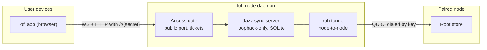

# Architecture and provenance

<!-- Source: FelineStateMachine/lofi-node README.md, src/{gate,tunnel,node}.ts,
     native/iroh-js/UPSTREAM.md, docs/port-iroh-js.md, CONTRIBUTING.md. -->

One daemon, three layers, each with a single job:

- **The gate is both enforcement and reachability.** The embedded Jazz server binds loopback-only
  and is verified to; the only path to it is through the gate, which validates tickets, strips and
  injects admin headers, and re-originates WebSockets. Access control is therefore not a mode the
  store honors — it is the shape of the network.
- **The tunnel carries exactly what Jazz speaks.** One iroh connection per WebSocket or HTTP
  request, opened with a HELLO frame naming its kind, path, and headers. Sync and catalogue traffic
  both ride it, which is why deploying against a leaf lands on the root without either side
  special-casing anything.
- **Pairing is upstream election.** A leaf's Jazz server chains to the root; re-election at runtime
  restarts Jazz on the same internal port while the gate keeps the public port stable.

## The version invariant

The data plane is Jazz 2.0 **alpha**, pinned exactly. A node must run the same alpha as the apps it
serves — treat version bumps as coordinated, release-lockstep changes, never drive-by. This is a
stated contract of the lofi-node repo (its contributing guide calls version pins decisions, with the
full suite as evidence).

## Native layer provenance

The iroh transport is a vendored port of the upstream `n0-computer/iroh-ffi` napi crate at module
granularity, with every local edit marked and an `UPSTREAM.md` recording provenance and the
tag-bump-by-diff procedure. Prebuilt libraries for the supported platform matrix are committed
in-repo, digest-pinned, and embedded into the compiled binary; at first run the right one extracts
to a version-keyed OS cache. Contributors changing the native layer start from
`native/iroh-js/UPSTREAM.md` and `docs/port-iroh-js.md` in the lofi-node repo.

## The library surface

Everything the CLI does, an embedder can do: `createSyncNode()` returns a node whose
`url`/`ticket()`/`issueTicket()`/`pair()`/`status()`/`stop()` are the same operations, and a test
mesh helper stands up paired topologies for suites. The generated [API reference](/node/api) covers
the full surface.
